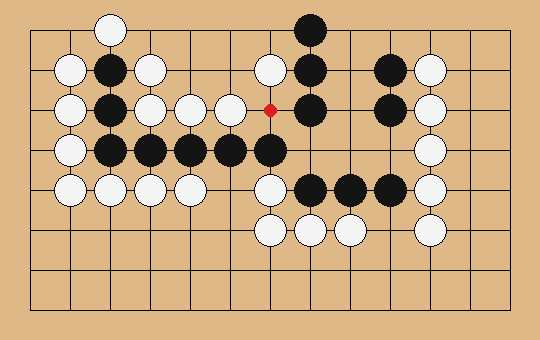

# 摸鱼死活题 (moyu_sihuoti)

一个放在 Mac 桌面上的围棋死活题/手筋题练习小组件。每天早上 8 点自动
刷新一批新题，直接在棋盘上点一下作答，立刻看对错——适合上班、学习间隙
的碎片时间随手做一道，不用打开任何 App。

> A macOS desktop widget for practicing Go/Weiqi life-and-death (tsumego)
> and tesuji problems. A fresh daily set refreshes every morning at 8am;
> click directly on the board to answer and get instant feedback. Built on
> [Übersicht](https://tracesof.net/uebersicht/). See below for English
> install notes.

> ### 题库来源与致谢
>
> **本项目没有自己创作任何题目。** 12,303 道题全部来自开源项目
> **[Ten Thousand Tsumego](https://github.com/sanderland/tsumego)**
> （作者 **Sander Land**，MIT 协议），其中大量原始题目文件由
> **TsumegoDojo** 收集整理；题目本身出自赵治勲、石田章、山田规三生、
> 前田陈尔、李昌镐、吴清源、瀬越宪作、橋本宇太郎等历代棋手与作者的
> 著作。本项目只做了两件事：格式转换，以及做一个桌面小组件来练习。
> 完整署名见 [NOTICE.md](./NOTICE.md)。
> 本项目为非官方衍生作品，与上述作者和项目无隶属关系。



*上图是数据转换校验时生成的示意图（棋形+正解点），不是组件真实界面截图
——真实组件更紧凑，细节见下方"界面说明"。*

## 功能

- **12,303 道题**，覆盖入门到专业段位：死活题（赵治勲死活百科、
  橋本宇太郎、山田规三生、前田陈尔等）+ 手筋题（吴清源・瀬越手筋辞典、
  李昌镐手筋、手筋大辞典等），共 55 个分册
- **每天早上 8 点刷新**一批新题（默认 8 道，可改），一整天随时回来做，
  不按小时强制解锁
- **点棋盘直接作答**，按真实黑白交替落子，有提子、禁入点、打劫判断；第一手对错立刻提示，答错会标出正解点
- **可选：KataGo 当对手**——装了之后你落子，对手会应一手，可以一直走下去看变化（没装也能用，只是对手不应手）
- **设置面板**：点组件右上角齿轮图标，勾选想练的题库分类、调整每日题量，
  保存后立刻按新设置重新抽题
- 所有数据和状态都在组件自己的文件夹里，不碰系统其它地方，删文件夹即
  完全卸载

## 安装

1. 安装 [Übersicht](https://tracesof.net/uebersicht/)（免费，Mac 桌面
   小组件引擎），打开一次。
2. 点菜单栏的 Übersicht 图标 →「Open Widgets Folder」，会打开
   `~/Library/Application Support/Übersicht/widgets/`。
3. 把本仓库里的 `widget/go-tsumego.widget` 整个文件夹复制到上面那个目录
   里（文件夹名字必须保持 `go-tsumego.widget` 不变）。
4. 确认电脑上有 `python3`（macOS 自带；没有的话 `brew install python3`）。
5. Übersicht 会自动发现新组件并显示在桌面上（默认右上角）。

```bash
# 也可以用命令行一步装好（把 <下载到的仓库路径> 换成你本地的路径）
cp -R <下载到的仓库路径>/widget/go-tsumego.widget \
  "$HOME/Library/Application Support/Übersicht/widgets/"
```

### Install (English)

1. Install [Übersicht](https://tracesof.net/uebersicht/) and open it once.
2. From its menu-bar icon, choose **Open Widgets Folder**.
3. Copy this repo's `widget/go-tsumego.widget` folder into that directory,
   keeping the folder name exactly `go-tsumego.widget`.
4. Make sure `python3` is available (`brew install python3` if not).
5. Übersicht will pick up the new widget automatically.

## 可选：安装 KataGo 让对手应手

题库本身只记录了"正解第一手"，没有后续变化。想看对手怎么应、答错怎么被杀，
需要本机有围棋 AI [KataGo](https://github.com/lightvector/KataGo)：

```bash
brew install katago
python3 "$HOME/Library/Application Support/Übersicht/widgets/go-tsumego.widget/engine.py" katago-status
```

第二条命令会告诉你组件有没有找到 KataGo 程序和模型文件。如果提示缺模型，
到 [KataGo 官方网络页](https://katagotraining.org/) 下载一个 `.bin.gz` 模型，
然后在组件文件夹的 `config.json` 里加上：

```json
{"katago": {"model": "/你的路径/模型.bin.gz"}}
```

没装 KataGo 时组件照常使用，只是落第一手后对手不会应手。

## 界面说明

- 棋盘：裁剪出题目相关的局部区域显示，不是整张 19 路棋盘
- 点棋盘任意交叉点 = 落一手（颜色按题目要求黑先/白先）；第一手会判对错，答错
  会在棋盘上标出正解点（可能不止一个，允许多解）。"重摆"按钮把棋盘恢复到初始局面
- 顶部显示当前题目来自哪本书、今天做了几题/对了几题
- 齿轮图标⚙：展开设置面板，按"入门死活 / 中级死活 / 高级死活 /
  橋本宇太郎死活 / 手筋 / 李昌镐手筋 / 手筋大辞典"七个大类勾选，也可以
  展开到具体某本书的颗粒度；底部数字框改每日题量

## 项目结构

```
moyu_sihuoti/
├── widget/go-tsumego.widget/   ← 真正要安装的组件（自包含）
│   ├── index.jsx                 组件界面（Übersicht/React）
│   ├── engine.py                 后端逻辑：选题、判对错、存设置
│   └── data/                     12,303 道题的数据（55 个分类 JSON + 索引）
├── scripts/convert.py           数据转换脚本（从上游仓库重新生成 data/ 用）
├── NOTICE.md                    数据来源与署名
└── LICENSE                      MIT
```

`engine.py` 不依赖任何第三方库，运行时会在 `go-tsumego.widget/` 文件夹里
自己生成三个小文件：

- `config.json` —— 你的题库偏好、每日题量
- `state.json` —— 今天抽到的题、做题进度
- `history.json` —— 最近做过的题号（用来避免短期内重复出同一题）

这三个文件都被 `.gitignore` 排除，不会被提交，也不会影响仓库里的题库
数据本身。

## 数据来源

- 上游项目：[Ten Thousand Tsumego](https://github.com/sanderland/tsumego)
  （Sander Land，MIT）。题库的收集、整理功劳属于该项目作者和
  TsumegoDojo，不属于本项目。
- 本项目所做的处理：把上游的 JSON 格式转换成组件使用的紧凑坐标格式，
  剔除了上游自己标注"答案可能不正确"的约 336 道题，以及 1 道局面不合法（有无气的棋子）的题，没有改动任何题目
  内容或正解。转换过程可用 `scripts/convert.py` 复现。
- 详细署名与授权说明见 [NOTICE.md](./NOTICE.md)。

## 贡献

欢迎提 issue / PR：报告坐标转换错误、补充更多公共题库、改进界面交互
都可以。改动题目数据前请留意 `NOTICE.md` 里的署名要求。

## License

MIT，见 [LICENSE](./LICENSE)。题库数据另有上游署名要求，见
[NOTICE.md](./NOTICE.md)。
